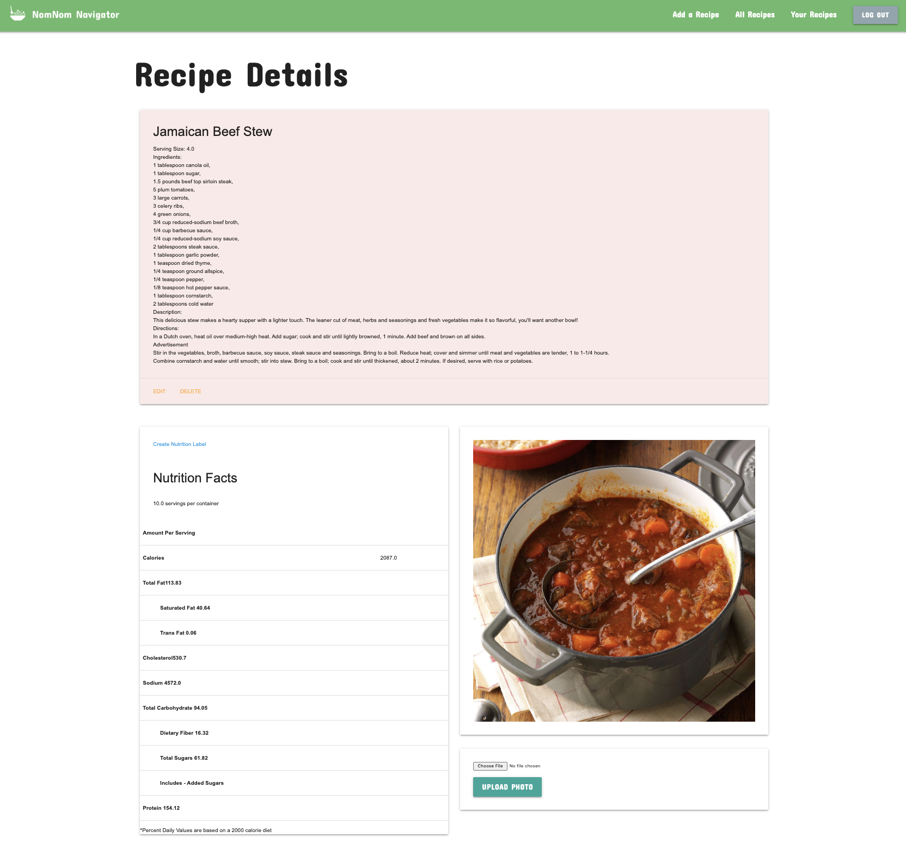
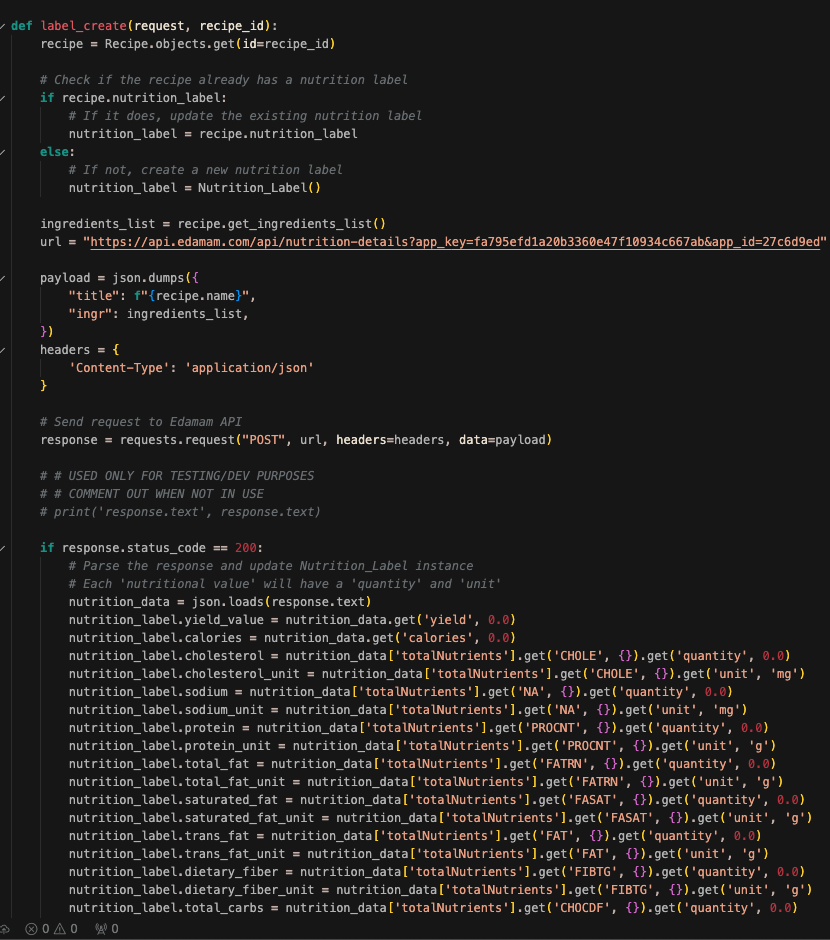
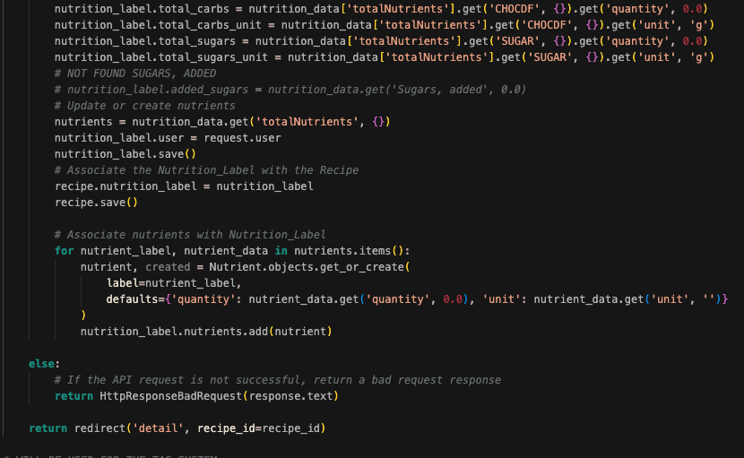

 
# What is  ?

NomNom Navigator is a practical app designed for easy meal planning. Users can save their own recipes, explore a variety of dishes from the community, and access detailed nutrition facts for their recipes. Whether you enjoy cooking or are focused on maintaining a healthy diet, NomNom Navigator simplifies the process of organizing, discovering, and understanding the nutritional content of your meals. It's the essential tool to streamline your cooking experience and keep your kitchen activities well-organized and informed.

# Inspiration

Our journey began with a fascination for the incredible capabilities of the Edamam API. This sparked our mission to create a user-friendly recipe app. We want to make storing and exploring recipes, along with understanding their nutritional value, easy for everyone.

# Technologies Used

# Getting Started
Link to live build: https://nomnom-navigators-f3c26b023052.herokuapp.com/

<b>Sign Up or Sign In:</b>
All users are required to create an account to add a recipe, edit or delete a recipe, add a photo, rate a recipe and comment on a recipe.

<b>Adding a recipe:</b>
Use the navbar to go to 'Add A Recipe'. On this page you can add in your serving size, ingredients, description and directions.

<b>Updating recipe details:</b>
Navigate to "Your Recipes" and click on the desired recipe to update any of the above infomration, or delete the recipe entirely. You can also add a photo in this section.

<b>Rate a recipe:</b>
Navigate to "All Recipes" and click on the targeted reciped. Scroll to the bottom and you may rate and add a comment on other users recipes.

# Challenges
Our hardest challenge was properly implementing the Edamam API. It was both of our first times working with an API to such an extent, so we ended up spending more than half of the duration of project week to get it where we wanted to. From simply fetching a 'response.text' in our terminal to properly getting it to render the information that we needed in our HTML files, each part came with its own headaches. In the end, however, it became one of our favorite pieces of code as it felt incredibly rewarding to finally get it to where we wanted to. Below is the 'label_create' function that handles both sending recipes' ingredients to the API as well as how we fetched every nutritional value that we needed. 

# Next Steps
- Make the Edamam API more intuitive by allowing users to select the serving amount for nutritonal data
- Include the 'Percent daily value' section to the nutrition label
- Add tags so users can search by cuisine type

